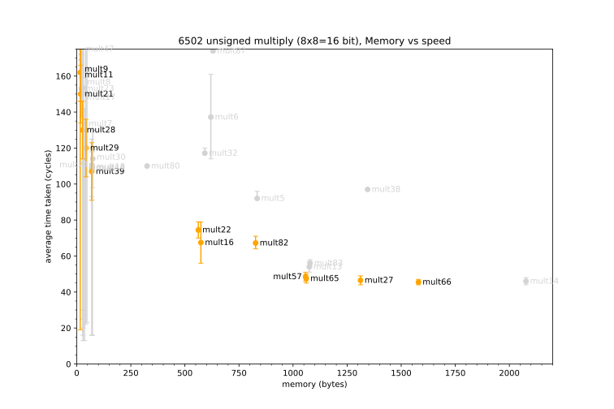
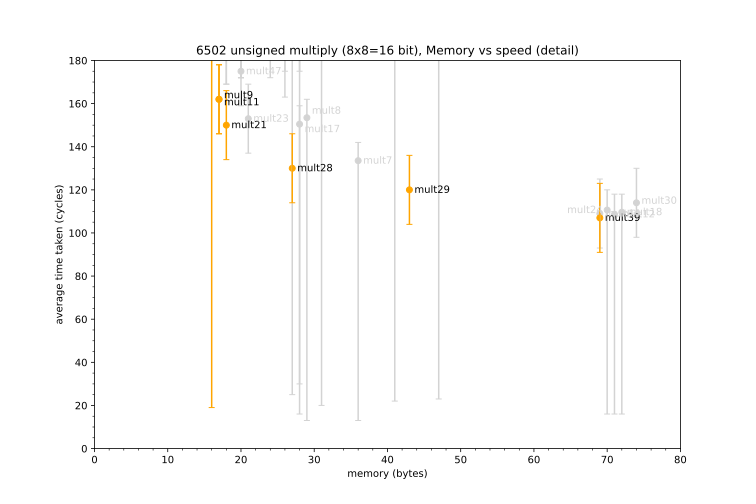
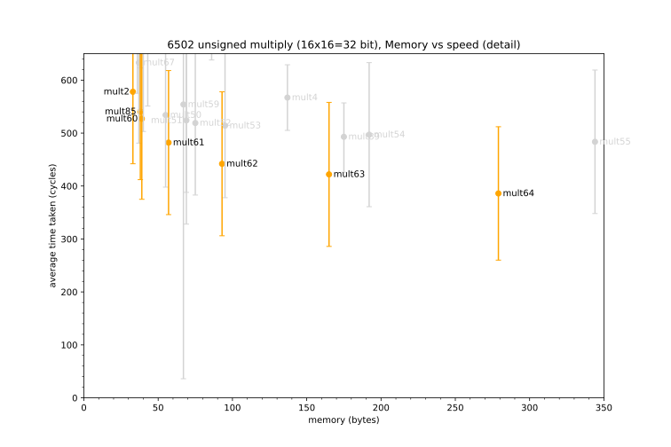
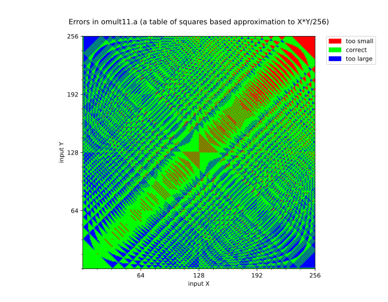
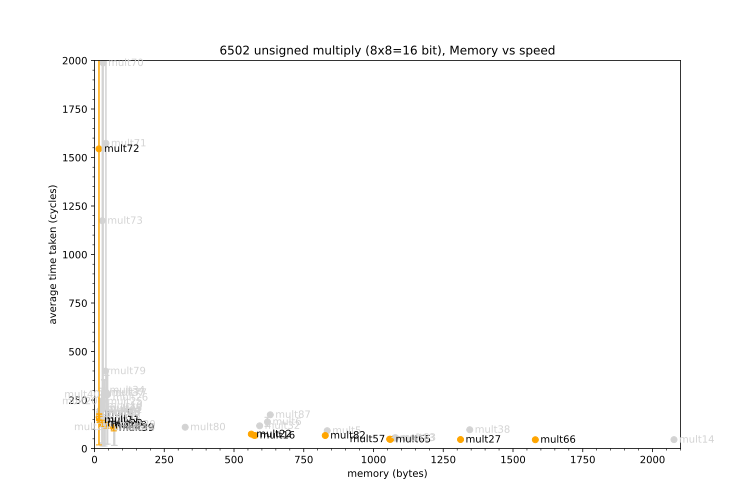

# 6502 Integer Multiplication - which is best?


## Contents

* [Introduction](#introduction)
* [The Implementations](#the-implementations)
* [The Results](#the-results)
* [The Algorithms](#the-algorithms)
	* [Binary Multiplication (Shift and Add)](#1-binary-multiplication-shift-and-add)
	* [Modified Shift and Add](#2-modified-shift-and-add)
	* [Tables of Squares](#3-tables-of-squares)
	* [Logarithms](#4-logarithms)
	* [Four bit multiply](#5-four-bit-multiply)
	* [Booth's Algorithm](#6-booths-algorithm)
    * [Hardware support](#7-hardware-support)
    * [Repeated addition](#8-repeated-addition)
* [Customising](#customising)
* [How to run the tests](#how-to-run-the-tests)


## Introduction

>"The search for the ultimate multiply routine seems never-ending." - Brooke W. Boering (December 1980)

This document compares the runtime performance and memory used by a wide variety of general purpose multiplication routines for the 6502 CPU. Over 120 different routines have been exhaustively tested, cycle counted, and the results plotted.

There is no one 'best' routine or algorithm, because there are always trade-offs between speed and memory. By *speed*, I mean the average, best and worst cases of how many cycles are needed to perform the multiplication. By *memory* I mean the total number of bytes needed for the code itself and all necessary data tables.

There may be other gains based on the context in which it is being used, e.g. the memory cost can be shared if data tables can be reused by other routines (for example a square root or division routine). Perhaps the multiplicands are more likely to lie in a given range. So it is not possible to recommend a single routine as 'best'. What we can say is that some routines are almost always, or actually always, worse than others. In practice, only a few are worth considering.

The most common routines available are for unsigned numbers, either 8 bit x 8 bit with a 16 bit result, or 16 bit x 16 bit with a 32 bit result. These are the natural focus, however several other routines are listed further down. There is also a section later that discusses how to how to customise the routines, e.g. how to handle signed numbers, adjusting to different bit sizes, etc.

## The Implementations

I have tested the following routines:

### Unsigned multiply

| Source code                  | Bits     | Method                    | From  |
| ---------------------------- | :------: | :-----------------------: | :---- |
| [mult1.a](tests/mult1.a)     | 16x16=32 | [shift&nbsp;and&nbsp;add](#1-binary-multiplication-shift-and-add) | [*6502 Software Design*](https://archive.org/details/6502softwaredesi0000scan/page/124/mode/1up) by Leo J Scanlon (1980) and [codebase64](https://www.codebase64.org/doku.php?id=base:16bit_multiplication_32-bit_product) (2015) |
| [mult2.a](tests/mult2.a)     | 16x16=32 | [shift&nbsp;and&nbsp;add](#1-binary-multiplication-shift-and-add) | *The Merlin 128 Macro Assembler* disk (Commodore 128) by Glen Bredon (1986), via [The Fridge](http://www.ffd2.com/fridge/math/mult-div.s)
| [mult3.a](tests/mult3.a)     | 16x16=32 | [shift&nbsp;and&nbsp;add](#1-binary-multiplication-shift-and-add) | [Neil Parker](https://llx.com/Neil/a2/mult.html) (2005) |
| [mult4.a](tests/mult4.a)     | 16x16=32 | [shift&nbsp;and&nbsp;add](#1-binary-multiplication-shift-and-add) | mult39 combined into a 16 bit multiply by TobyLobster (2022) |
| [mult5.a](tests/mult5.a)     | 8x8=16   | [tables of squares](#3-tables-of-squares)                         | [yerricde at everything2](https://everything2.com/user/yerricde/writeups/Fast+6502+multiplication) (2001) |
| [mult6.a](tests/mult6.a)     | 8x8=16   | [tables of squares](#3-tables-of-squares)                         | [eurorusty at everything2](https://everything2.com/user/eurorusty/writeups/Fast+6502+multiplication) (2013) |
| [mult7.a](tests/mult7.a)     | 8x8=16   | [shift&nbsp;and&nbsp;add](#1-binary-multiplication-shift-and-add) | [*Apple Assembly Line*, January 1986](http://www.txbobsc.com/aal/1986/aal8601.html#a5) |
| [mult8.a](tests/mult8.a)     | 8x8=16   | [shift&nbsp;and&nbsp;add](#1-binary-multiplication-shift-and-add) | [*Apple Assembly Line*, January 1986](http://www.txbobsc.com/aal/1986/aal8601.html#a5) |
| [mult9.a](tests/mult9.a)     | 8x8=16   | [shift&nbsp;and&nbsp;add](#1-binary-multiplication-shift-and-add) | [The Fridge](http://www.ffd2.com/fridge/math/mult-div8.s) (2000) |
| [mult10.a](tests/mult10.a)   | 8x8=16   | [shift&nbsp;and&nbsp;add](#1-binary-multiplication-shift-and-add) | [White Flame at codebase64](https://www.codebase64.org/doku.php?id=base:8bit_multiplication_16bit_product) (2015) |
| [mult11.a](tests/mult11.a)   | 8x8=16   | [shift&nbsp;and&nbsp;add](#1-binary-multiplication-shift-and-add) | [graham at codebase64](https://www.codebase64.org/doku.php?id=base:short_8bit_multiplication_16bit_product) (2015) |
| [mult12.a](tests/mult12.a)   | 8x8=16   | [shift&nbsp;and&nbsp;add](#1-binary-multiplication-shift-and-add) | [djmips at codebase64](https://www.codebase64.org/doku.php?id=base:8bit_multiplication_16bit_product_fast_no_tables) (2020) |
| [mult13.a](tests/mult13.a)   | 8x8=16   | [tables of squares](#3-tables-of-squares)                         | [*Apple Assembly Line*, March 1986](http://www.txbobsc.com/aal/1986/aal8603.html#a5) |
| [mult14.a](tests/mult14.a)   | 8x8=16   | [tables of squares](#3-tables-of-squares)                         | [Jackasser at codebase64](https://codebase64.org/doku.php?id=base:seriously_fast_multiplication) (2015) |
| [mult15.a](tests/mult15.a)   | 16x16=32 | [tables of squares](#3-tables-of-squares)                         | [Repose at codebase64](https://www.codebase64.org/doku.php?id=base:fastest_multiplication) (2017, updated in 2023) |
| [mult16.a](tests/mult16.a)   | 8x8=16   | [tables of squares](#3-tables-of-squares)                         | [litwr (Vladimir Lidovski) and Urusergi codebase64](https://www.codebase64.org/doku.php?id=base:another_fast_8bit_multiplication) (2015) |
| [mult17.a](tests/mult17.a)   | 8x8=16   | [shift&nbsp;and&nbsp;add](#1-binary-multiplication-shift-and-add) | [*Elite* (BBC Micro)](https://www.bbcelite.com/cassette/main/subroutine/mu11.html) (1984) |
| [mult18.a](tests/mult18.a)   | 8x8=16   | [shift&nbsp;and&nbsp;add](#1-binary-multiplication-shift-and-add) | [*Elite* (BBC Master version)](https://www.bbcelite.com/master/main/subroutine/mu11.html) (1986) |
| [mult19.a](tests/mult19.a)   | 8x8=16   | [shift&nbsp;and&nbsp;add](#1-binary-multiplication-shift-and-add) | [Australian Personal Computer, Aug 1984](https://archive.org/details/apc_1984_08/page/115/mode/2up?q=6502+multiplication) and [Neil Parker](https://www.llx.com/Neil/a2/mult.html) (2005) |
| [mult20.a](tests/mult20.a)   | 8x8=16   | [shift&nbsp;and&nbsp;add](#1-binary-multiplication-shift-and-add) | [Becoming Julie](https://becomingjulie.blogspot.com/2020/07/multiplying-on-6502-but-faster.html) (2020) |
| [mult21.a](tests/mult21.a)   | 8x8=16   | [shift&nbsp;and&nbsp;add](#1-binary-multiplication-shift-and-add) | [*Machine Code for the Atmos and Oric-I*](https://archive.org/details/shiva-machine-code-for-the-atmos-and-oric-i/page/78/mode/2up) by Bruce Smith (1984) and [Niels Möller](https://www.lysator.liu.se/~nisse/misc/6502-mul.html) (2015) |
| [mult22.a](tests/mult22.a)   | 8x8=16   | [tables of squares](#3-tables-of-squares)                         | [Niels Möller](https://www.lysator.liu.se/~nisse/misc/6502-mul.html) (2015) |
| [mult23.a](tests/mult23.a)   | 8x8=16   | [shift&nbsp;and&nbsp;add](#1-binary-multiplication-shift-and-add) | [tepples at NesDev](https://www.nesdev.org/wiki/8-bit_Multiply) (2017) |
| [mult24.a](tests/mult24.a)   | 8x8=16   | [shift&nbsp;and&nbsp;add](#1-binary-multiplication-shift-and-add) | [tepples unrolled at NesDev](https://www.nesdev.org/wiki/8-bit_Multiply) (2017) |
| [mult25.a](tests/mult25.a)   | 8x8=16   | [shift&nbsp;and&nbsp;add](#1-binary-multiplication-shift-and-add) | [Bregalad at NesDev](https://www.nesdev.org/wiki/8-bit_Multiply) (2009) |
| [mult26.a](tests/mult26.a)   | 8x8=16   | [shift&nbsp;and&nbsp;add](#1-binary-multiplication-shift-and-add) | [frantik at NesDev](https://www.nesdev.org/wiki/8-bit_Multiply) (2017) |
| [mult27.a](tests/mult27.a)   | 8x8=16   | [tables of squares](#3-tables-of-squares)                         | [H2Obsession](https://sites.google.com/site/h2obsession/programming/6502) (2013) |
| [mult28.a](tests/mult28.a)   | 8x8=16   | [shift&nbsp;and&nbsp;add](#1-binary-multiplication-shift-and-add) | [*Apple Assembly Line*, January 1986](http://www.txbobsc.com/aal/1986/aal8601.html#a5) |
| [mult29.a](tests/mult29.a)   | 8x8=16   | [shift&nbsp;and&nbsp;add](#1-binary-multiplication-shift-and-add) | [*Apple Assembly Line*, January 1986](http://www.txbobsc.com/aal/1986/aal8601.html#a5) (unrolled) |
| [mult30.a](tests/mult30.a)   | 8x8=16   | [shift&nbsp;and&nbsp;add](#1-binary-multiplication-shift-and-add) | [tepples unrolled at NesDev](https://www.nesdev.org/wiki/8-bit_Multiply) (2017) (adjusted) |
| [mult31.a](tests/mult31.a)   | 16x16=32 | [tables of squares](#3-tables-of-squares)                         | [Jackasser at codebase64](https://codebase64.org/doku.php?id=base:seriously_fast_multiplication) (2015) |
| [mult32.a](tests/mult32.a)   | 8x8=16   | [4 bit multiply](#5-four-bit-multiply)                            | [keldon at everything2](https://everything2.com/user/keldon/writeups/Fast+6502+multiplication) (2017) |
| [mult33.a](tests/mult33.a)   | 16x16=32 | [tables of squares](#3-tables-of-squares)                         | [Retro64](https://retro64.altervista.org/ProgrammingExamples/AssemblyLanguage/fast_mult_16bit_v05_pres.txt) (2019) |
| [mult34.a](tests/mult34.a)   | 8x8=16   | [shift&nbsp;and&nbsp;add](#1-binary-multiplication-shift-and-add) | [*Atari Roots*](https://archive.org/details/ataribooks-atari-roots/page/n169/mode/2up) by Mark Andrews (1984) |
| [mult35.a](tests/mult35.a)   | 8x8=16   | [shift&nbsp;and&nbsp;add](#1-binary-multiplication-shift-and-add) | [*Atari Roots*](https://archive.org/details/ataribooks-atari-roots/page/n173/mode/2up) by Mark Andrews (1984) |
| [mult36.a](tests/mult36.a)   | 16x16=32 | [shift&nbsp;and&nbsp;add](#1-binary-multiplication-shift-and-add) | [*Best of Personal Computer World, ASSEMBLER ROUTINES FOR THE 6502*](https://archive.org/details/assembler-routines-for-the-6502/page/162/mode/2up) by David Barrow (1985) |
| [mult37.a](tests/mult37.a)   | 8x8=16   | [shift&nbsp;and&nbsp;add](#1-binary-multiplication-shift-and-add) | [Andrew Blance, at codeburst](https://codeburst.io/lets-write-some-harder-assembly-language-code-c7860dcceba) (2020) |
| [mult38.a](tests/mult38.a)   | 8x8=16   | [4 bit multiply](#5-four-bit-multiply)                            | [*Aviator* (BBC Micro)](https://aviator.bbcelite.com/source/main/subroutine/multiply8x8.html) (1983) |
| [mult39.a](tests/mult39.a)   | 8x8=16   | [shift&nbsp;and&nbsp;add](#1-binary-multiplication-shift-and-add) | [*Revs* (BBC Micro)](https://revs.bbcelite.com/source/main/subroutine/multiply8x8.html) (1985) |
| [mult40.a](tests/mult40.a)   | 8x8=16   | [shift&nbsp;and&nbsp;add](#1-binary-multiplication-shift-and-add) | [*Meteors* (BBC Micro)](https://gitlab.riscosopen.org/RiscOS/Sources/Apps/Diversions/Meteors/-/blob/master/Srce6502/MetSrc) (1982) |
| [mult41.a](tests/mult41.a)   | 16x16=32 | [tables of squares](#3-tables-of-squares)                         | mult13 combined into a 16 bit multiply by TobyLobster (2022) |
| [mult42.a](tests/mult42.a)   | 16x16=32 | [tables of squares](#3-tables-of-squares)                         | mult16 combined into a 16 bit multiply by TobyLobster (2022) |
| [mult43.a](tests/mult43.a)   | 8x8=16   | [shift&nbsp;and&nbsp;add](#1-binary-multiplication-shift-and-add) | [*6502 assembly language programming*](https://archive.org/details/6502-assembly-language-programming/page/n251/mode/2up) by Lance A. Leventhal |
| [mult44.a](tests/mult44.a)   | 8x8=16   | [shift&nbsp;and&nbsp;add](#1-binary-multiplication-shift-and-add) | [*The Sentinel* (BBC Micro)](http://level7.org.uk/miscellany/the-sentinel-disassembly.txt) (1988) |
| [mult45.a](tests/mult45.a)   | 16x16=32 | [shift&nbsp;and&nbsp;add](#1-binary-multiplication-shift-and-add) | [*How to program the Apple II Using 6502 Assembly Language*](https://archive.org/details/Using_6502_Assembly_Language/page/n197/mode/2up) by Randy Hyde (1981) |
| [mult46.a](tests/mult46.a)   | 16x16=32 | [shift&nbsp;and&nbsp;add](#1-binary-multiplication-shift-and-add) | [*Apple Programmers Handbook*](https://archive.org/details/sams-apple-programmers-handbook/page/220/mode/2up?q=multiply) by Paul Irwin (1984) |
| [mult47.a](tests/mult47.a)   | 8x8=16   | [shift&nbsp;and&nbsp;add](#1-binary-multiplication-shift-and-add) | [*Neil Parker*](https://llx.com/Neil/a2/mult.html) (2005) |
| [mult48.a](tests/mult48.a)   | 16x16=32 | [shift&nbsp;and&nbsp;add](#1-binary-multiplication-shift-and-add) | [Micro 6502 Journal Issue 31, Dec 1980, p71-74](https://archive.org/details/micro-6502-journal-31/page/n73/mode/2up) by Brooke Boering |
| [mult49.a](tests/mult49.a)   | 16x16=32 | [shift&nbsp;and&nbsp;add](#1-binary-multiplication-shift-and-add) | [Micro 6502 Journal Issue 31, Dec 1980, p71-74](https://archive.org/details/micro-6502-journal-31/page/n73/mode/2up) by Brooke Boering, with 8x16 multiply 'shortcut' removed |
| [mult50.a](tests/mult50.a)   | 16x16=32 | [shift&nbsp;and&nbsp;add](#1-binary-multiplication-shift-and-add) | mult2 unrolled by TobyLobster (2023) |
| [mult51.a](tests/mult51.a)   | 16x16=32 | [shift&nbsp;and&nbsp;add](#1-binary-multiplication-shift-and-add) | mult2 unrolled by TobyLobster (2023) |
| [mult52.a](tests/mult52.a)   | 16x16=32 | [shift&nbsp;and&nbsp;add](#1-binary-multiplication-shift-and-add) | mult2 unrolled by TobyLobster (2023) |
| [mult53.a](tests/mult53.a)   | 16x16=32 | [shift&nbsp;and&nbsp;add](#1-binary-multiplication-shift-and-add) | mult2 unrolled by TobyLobster (2023) |
| [mult54.a](tests/mult54.a)   | 16x16=32 | [shift&nbsp;and&nbsp;add](#1-binary-multiplication-shift-and-add) | mult2 unrolled by TobyLobster (2023) |
| [mult55.a](tests/mult55.a)   | 16x16=32 | [shift&nbsp;and&nbsp;add](#1-binary-multiplication-shift-and-add) | mult2 fully unrolled by TobyLobster (2023) |
| [mult56.a](tests/mult56.a)   | 16x16=32 | [tables of squares](#3-tables-of-squares)                         | mult27 combined into a 16 bit multiply by TobyLobster (2023) |
| [mult57.a](tests/mult57.a)   | 8x8=16   | [tables of squares](#3-tables-of-squares)                         | [H2Obsession](https://sites.google.com/site/h2obsession/programming/6502) smaller memory version without idTab (2013) |
| [mult58.a](tests/mult58.a)   | 16x16=32 | [tables of squares](#3-tables-of-squares)                         | mult16 combined into a 16 bit multiply by TobyLobster (2023)|
| [mult59.a](tests/mult59.a)   | 16x16=32 | [modified shift&nbsp;and&nbsp;add](#2-modified-shift-and-add)     | [Dr Jefyll](http://forum.6502.org/viewtopic.php?f=9&t=689&start=0#p19958) (2012) |
| [mult60.a](tests/mult60.a)   | 16x16=32 | [modified shift&nbsp;and&nbsp;add](#2-modified-shift-and-add)     | [Dr Jefyll](http://forum.6502.org/viewtopic.php?f=9&t=689&start=0#p19958) (2012) with modifications by TobyLobster (2023) |
| [mult61.a](tests/mult61.a)   | 16x16=32 | [modified shift&nbsp;and&nbsp;add](#2-modified-shift-and-add)     | [Dr Jefyll](http://forum.6502.org/viewtopic.php?f=9&t=689&start=0#p19958) (2012) with modifications and unrolling by TobyLobster (2023) |
| [mult62.a](tests/mult62.a)   | 16x16=32 | [modified shift&nbsp;and&nbsp;add](#2-modified-shift-and-add)     | [Dr Jefyll](http://forum.6502.org/viewtopic.php?f=9&t=689&start=0#p19958) (2012) with modifications and unrolling by TobyLobster (2023) |
| [mult63.a](tests/mult63.a)   | 16x16=32 | [modified shift&nbsp;and&nbsp;add](#2-modified-shift-and-add)     | [Dr Jefyll](http://forum.6502.org/viewtopic.php?f=9&t=689&start=0#p19958) (2012) with modifications and unrolling by TobyLobster (2023) |
| [mult64.a](tests/mult64.a)   | 16x16=32 | [modified shift&nbsp;and&nbsp;add](#2-modified-shift-and-add)     | [Dr Jefyll](http://forum.6502.org/viewtopic.php?f=9&t=689&start=0#p19958) (2012) with modifications and unrolling by TobyLobster (2023) |
| [mult65.a](tests/mult65.a)   | 8x8=16   | [tables of squares](#3-tables-of-squares)                         | [Nick Jameson's 3D Demo](https://github.com/simondotm/bbc-micro-3d/tree/master/source) for the BBC Micro (1994) |
| [mult66.a](tests/mult66.a)   | 8x8=16   | [tables of squares](#3-tables-of-squares)                         | TobyLobster (2023), based on [Nick Jameson's 3D Demo](https://github.com/simondotm/bbc-micro-3d/tree/master/source) for the BBC Micro (1994) |
| [mult67.a](tests/mult67.a)   | 16x16=32 | [tables of squares](#3-tables-of-squares)                         | [julie_m at stardot](https://stardot.org.uk/forums/viewtopic.php?p=380587#p380587) (Note: preserves carry) (2023) |
| [mult68.a](tests/mult68.a)   | 8x8=16   | [shift&nbsp;and&nbsp;add](#1-binary-multiplication-shift-and-add) | [*Programming The 6502*](https://archive.org/details/Programming_the_6502_OCR/page/n89/mode/2up) by Rodnay Zaks (1983) |
| [mult69.a](tests/mult69.a)   | 16x16=32 | [shift&nbsp;and&nbsp;add](#1-binary-multiplication-shift-and-add) | [*Machine Language Routines for the Commodore 64 and 128*](https://archive.org/details/Compute_s_Machine_Language_Routines_for_the_Commodore_64_and_128/page/363/mode/2up*) by Todd D Heimarck and Patrick Parrish (1987) |
| [mult70.a](tests/mult70.a)   | 8x8=16   | [repeated addition](#8-repeated-addition)                         | [*Machine Language Routines for the Commodore 64 and 128*](https://archive.org/details/Compute_s_Machine_Language_Routines_for_the_Commodore_64_and_128/page/357/mode/2up*) by Todd D Heimarck and Patrick Parrish (1987) |
| [mult71.a](tests/mult70.a)   | 8x8=16   | [repeated addition](#8-repeated-addition)                         | [*Machine Language Routines for the Commodore 64 and 128*](https://archive.org/details/Compute_s_Machine_Language_Routines_for_the_Commodore_64_and_128/page/359/mode/2up*) by Todd D Heimarck and Patrick Parrish (1987) |
| [mult72.a](tests/mult72.a)   | 8x8=16   | [repeated addition](#8-repeated-addition)                         | TobyLobster (2023) |
| [mult73.a](tests/mult73.a)   | 8x8=16   | [repeated addition](#8-repeated-addition)                         | TobyLobster (2023) |
| [mult74.a](tests/mult74.a)   | 16x16=32 | [shift&nbsp;and&nbsp;add](#1-binary-multiplication-shift-and-add) | *Mikroprozessoren 6502, 6800, 8080, Z80, 9900* by Harald Schumny (1983) |
| [mult75.a](tests/mult75.a)   | 8x8=16   | [shift&nbsp;and&nbsp;add](#1-binary-multiplication-shift-and-add) | *Practical Microcomputer Programming* by Walter J Weller (1980) |
| [mult76.a](tests/mult76.a)   | 8x8=16   | [shift&nbsp;and&nbsp;add](#1-binary-multiplication-shift-and-add) | [*Microcomputing* magazine (June 1981)](https://archive.org/details/kilobaudmagazine-1981-06/page/n109/mode/2up) article by Leo Scanlon |
| [mult77.a](tests/mult77.a)   | 8x8=16   | [shift&nbsp;and&nbsp;add](#1-binary-multiplication-shift-and-add) | [*Instrumentation of a Savonius Wind Turbine*](https://archive.org/details/instrumentationo00babb/page/108/mode/2up) by Samuel Martin Babb (1979) |
| [mult78.a](tests/mult78.a)   | 8x8=16   | [shift&nbsp;and&nbsp;add](#1-binary-multiplication-shift-and-add) | [*Commodore 128 Assembly Language Programming*](https://archive.org/details/Commodore_128_Assembly_Language_Programming/page/n165/mode/2up) by Mark Andrews (1986) |
| [mult79.a](tests/mult78.a)   | 8x8=16   | [shift&nbsp;and&nbsp;add](#1-binary-multiplication-shift-and-add) | [*NASA Report*](https://archive.org/details/NASA_NTRS_Archive_19820015020/page/n65/mode/2up) (1981) |
| [mult80.a](tests/mult80.a)   | 8x8=16   | [four bit multiply](#5-four-bit-multiply)                         | [Kakemoms at *Denial, the Commodore Vic 20 Forum*](http://sleepingelephant.com/ipw-web/bulletin/bb/viewtopic.php?p=82071#p82071) (2015) |
| [mult81.a](tests/mult81.a)   | 8x8=16   | [shift&nbsp;and&nbsp;add](#1-binary-multiplication-shift-and-add) | [*Graphics Extension ROM*](http://www.computinghistory.org.uk/det/18670/Graphics%20Extension%20ROM%20for%20the%20BBC%20Microcomputer/) by Acornsoft (1985) at $b8d4 |
| [mult82.a](tests/mult82.a)   | 8x8=16   | [tables of squares](#3-tables-of-squares)                         | [*Retro Software*](http://www.retrosoftware.co.uk/wiki/index.php?title=Fast_multiplication_routines) (2008) |
| [mult83.a](tests/mult83.a)   | 8x8=16   | [tables of squares](#3-tables-of-squares)                         | [*Retro Software*](http://www.retrosoftware.co.uk/wiki/index.php?title=Fast_multiplication_routines) (2008) |
| [mult84.a](tests/mult84.a)   | 16x16=32 | [tables of squares](#3-tables-of-squares)                         | TobyLobster (2023), based on mult66.a |
| [mult85.a](tests/mult85.a)   | 16x16=32 | [shift&nbsp;and&nbsp;add](#1-binary-multiplication-shift-and-add) | jbrandwood (2024), based on mult2.a |
| [mult86.a](tests/mult86.a)   | 16x16=32 | [tables of squares](#3-tables-of-squares)                         | [Repose at 6502.org](http://forum.6502.org/viewtopic.php?p=106519#p106519) (2024), based on mult15 |
| [mult87.a](tests/mult87.a)   | 8x8=16   | [4 bit multiply](#5-four-bit-multiply)                            | [MVittiS at GitHub](https://github.com/MVittiS/Fast6502Mult/blob/master/mult4packed.s) (2018) |
| [mult88.a](tests/mult88.a)   | 16x16=32 | [shift&nbsp;and&nbsp;add](#1-binary-multiplication-shift-and-add) | [Acornsoft LISP](https://stardot.org.uk/forums/viewtopic.php?p=395940#p395940) (1982) |

### Signed multiply

| Source code                  | Bits                | Method                    | From  |
| ---------------------------- | :-----------------: | :-----------------------: | :---- |
| [smult1.a](tests/smult1.a)   | 8x8=16   (*signed*) | [tables of squares](#3-tables-of-squares)                         | [Jackasser at codebase64](https://codebase64.org/doku.php?id=base:seriously_fast_multiplication) (2015) |
| [smult2.a](tests/smult2.a)   | 8x8=16   (*signed*) | [Booth's algorithm](#6-booths-algorithm)                          | [Marcus Thill](https://markusthill.github.io/programming/an-efficient-implementation-of-the-booth-algorithm-in-6502-assembler/) (2017) |
| [smult3.a](tests/smult3.a)   | 16x16=32 (*signed*) | [tables of squares](#3-tables-of-squares)                         | [Jackasser at codebase64](https://codebase64.org/doku.php?id=base:seriously_fast_multiplication) (2015) |
| [smult4.a](tests/smult4.a)   | 8x8=16   (*signed*) | [shift&nbsp;and&nbsp;add](#1-binary-multiplication-shift-and-add) | [Neil Parker](https://llx.com/Neil/a2/mult.html) (2005) |
| [smult5.a](tests/smult5.a)   | 8x8=16   (*signed*) | [shift&nbsp;and&nbsp;add](#1-binary-multiplication-shift-and-add) | mult9 converted to signed multiply by TobyLobster (2022) |
| [smult6.a](tests/smult6.a)   | 8x8=16   (*signed*) | [shift&nbsp;and&nbsp;add](#1-binary-multiplication-shift-and-add) | [*EDN* magazine (5th Sept 1979)](https://archive.org/details/edn-1979_09_05/page/118/mode/2up), article by Arch D Robison |
| [smult7.a](tests/smult7.a)   | 8x8=16   (*signed*) | [tables of squares](#3-tables-of-squares)                         | [Oswald/Resource at codebase64](https://www.codebase64.org/doku.php?id=base:fast_8bit_multiplication_16bit_product) (2015) |
| [smult8.a](tests/smult8.a)   | 8x8=16   (*signed*) | [tables of squares](#3-tables-of-squares)                         | mult65 converted to signed multiply by TobyLobster (2022) |
| [smult9.a](tests/smult9.a)   | 16x16=32 (*signed*) | [modified shift&nbsp;and&nbsp;add](#2-modified-shift-and-add)     | [Dr Jefyll](http://forum.6502.org/viewtopic.php?f=9&t=689&start=0#p19958) (2012) with modifications by TobyLobster (2023) |
| [smult10.a](tests/smult10.a) | 8x8=16   (*signed*) | [tables of squares](#3-tables-of-squares)                         | [Piotr Fusik in the short lived Polish Atari disk magazine Syzygy, issue 6](http://ftp.pigwa.net/stuff/collections/atari_forever/Ziny/Syzygy/) (1999), see English version [here](https://forums.atariage.com/topic/78839-russian-multiplication/#comment-975865) |
| [smult11.a](tests/smult11.a) | 8x8=16   (*signed*) | [tables of squares](#3-tables-of-squares)                         | variant of [Piotr Fusik in Syzygy 6](http://ftp.pigwa.net/stuff/collections/atari_forever/Ziny/Syzygy/) (1999) |

### Miscellaneous multiply

Specialised multiply routines often find their niche in games. Partial results (a result with fewer bits than expected) are common for fixed point arithmetic. Even approximate results can be used in cases where speed is more important than absolute accuracy.

| Source code                  | Bits                                          | Method                    | From  |
| ---------------------------- | :-------------------------------------------: | :-----------------------: | :---- |
| [omult1.a](tests/omult1.a)   | 16x16=16 (*partial result,low 16 bits only*)  | [shift&nbsp;and&nbsp;add](#1-binary-multiplication-shift-and-add) | [*Programming the 65816*](https://archive.org/details/0893037893ProgrammingThe65816/page/n295/mode/2up?q=multiply) by David Eyes (1986) |
| [omult2.a](tests/omult2.a)   | 8x8=8    (*partial result, low byte only*)    | [shift&nbsp;and&nbsp;add](#1-binary-multiplication-shift-and-add) | [*The BBC Micro Compendium*](https://archive.org/details/BBCMicroCompendium/page/38/mode/2up) by Jeremy Ruston (1983), also [*Nightshade*](http://level7.org.uk/miscellany/nightshade-disassembly.txt) (1985) at $6121 |
| [omult3.a](tests/omult3.a)   | 8x8=8    (*partial result, high byte only*)   | [shift&nbsp;and&nbsp;add](#1-binary-multiplication-shift-and-add) | [*Elite* for the BBC Micro](https://www.bbcelite.com/cassette/main/subroutine/fmltu.html) (1984) |
| [omult4.a](tests/omult4.a)   | 24x8=32  (*sign-magnitude* numbers)           | [shift&nbsp;and&nbsp;add](#1-binary-multiplication-shift-and-add) | [*Elite* for the BBC Micro](https://www.bbcelite.com/cassette/main/subroutine/mult3.html) (1984) |
| [omult5.a](tests/omult5.a)   | 16x16=16 (approximate 2 high bytes only)      | [shift&nbsp;and&nbsp;add](#1-binary-multiplication-shift-and-add) | [*The Sentinel* for the BBC Micro](http://level7.org.uk/miscellany/the-sentinel-disassembly.txt) (1988) |
| [omult6.a](tests/omult6.a)   | 16x16=16 (*low 16 bit result*, or carry set if overflow occurs) | [shift&nbsp;and&nbsp;add](#1-binary-multiplication-shift-and-add) | [The Commodore 64 BASIC/KERNAL ROM](https://github.com/mist64/c64ref/blob/master/Source/c64disasm/c64disasm_en.txt) at $b357 and [Applesoft II BASIC](https://6502disassembly.com/a2-rom/Applesoft.html) at $e2b8 |
| [omult7.a](tests/omult7.a)   | 8x8=8    (*partial result, approx high byte*) | [log and exp tables](#4-logarithms) | [*Elite*, BBC Master version](https://www.bbcelite.com/master/main/subroutine/fmltu.html) (1986) and [APPLE II *Elite*](https://6502disassembly.com/a2-elite/Elite.html#SymFMLTU) (1985) |
| [omult8.a](tests/omult8.a)   | 8x8=8    (*partial result, approx high byte*) | [log and exp tables](#4-logarithms) | [*Elite*, Second Processor version](https://www.bbcelite.com/6502sp/main/subroutine/fmltu.html) (1985) |
| [omult9.a](tests/omult9.a)   | 8x8=8    (*partial result, approx high byte*) | [log and exp tables](#4-logarithms) | from articles by Gunnar 'Krill' Ruthenburg / Plush in the German *GO64!* magazine (2000), via [codebase64](https://codebase64.org/doku.php?id=base:mathematics_in_assembly_part_6) |
| [omult10.a](tests/omult10.a) | 16x32=32 (*partial result,low 32 bits only*)  | [shift&nbsp;and&nbsp;add](#1-binary-multiplication-shift-and-add) | [BBC BASIC ROM](https://archive.org/details/BBCMicroCompendium/page/364/mode/2up) integer multiply code (1981) |
| [omult11.a](tests/omult11.a) | 8x8=8    (*partial result, high byte only*)   | [tables of squares](#3-tables-of-squares)                         | mult13 reduced to return high byte only by TobyLobster (2023) |
| [omult12.a](tests/omult12.a) | 8x8=8    (*partial result, low byte only*)    | [shift&nbsp;and&nbsp;add](#1-binary-multiplication-shift-and-add) | [*Gateway to Apshai*, for the Atari 8-bit family](http://bringerp.free.fr/RE/Gta/downloads.php5) (1983) |
| [omult13.a](tests/omult13.a) | 16x8=16  (*partial result*, div 128)          | [shift&nbsp;and&nbsp;add](#1-binary-multiplication-shift-and-add) | [*Stellar 7*, for the Apple II](https://6502disassembly.com/a2-stellar7/ROCK1.html) (1983) |
| [omult14.a](tests/omult14.a) | 16x16=16 (*partial result,low 16 bits only*)  | [shift&nbsp;and&nbsp;add](#1-binary-multiplication-shift-and-add) | [FastBasic](https://github.com/dmsc/fastbasic/blob/master/src/interp/mul.asm) BASIC interpreter for the Atari 8-bit computers (2017) |
| [omult15.a](tests/omult15.a) | 16x16=16 (*partial result,low 16 bits only*)  | [modified shift&nbsp;and&nbsp;add](#2-modified-shift-and-add)     | [Dr Jefyll](http://forum.6502.org/viewtopic.php?f=9&t=689&start=0#p19958) (2012) with modifications by TobyLobster (2023) |
| [omult16.a](tests/omult16.a) | 16x16=16 (*partial result,low 16 bits only*)  | [tables of squares](#3-tables-of-squares)                         | [BBC BASIC ROM](https://archive.org/details/BBCMicroCompendium/page/302/mode/1up?q=9236) multidimensional array access code (1981) |
| [omult17.a](tests/omult17.a) | 16x8=16  (*partial result,low 16 bits only*)  | [shift&nbsp;and&nbsp;add](#1-binary-multiplication-shift-and-add) | [*How to program microcomputers*](https://archive.org/details/howtoprogrammicr00bard/page/192/mode/2up) by William T Barden (1977) |
| [omult18.a](tests/omult18.a) | mxn=n+m (*variable size multiply*)            | [shift&nbsp;and&nbsp;add](#1-binary-multiplication-shift-and-add) | [*Microcomputing* magazine (June 1981)](https://archive.org/details/kilobaudmagazine-1981-06/page/n113/mode/2up) article by Leo J Scanlon |
| [omult19.a](tests/omult19.a) | 24x24=48                                      | [shift&nbsp;and&nbsp;add](#1-binary-multiplication-shift-and-add) | [*Graphics Extension ROM*](http://www.computinghistory.org.uk/det/18670/Graphics%20Extension%20ROM%20for%20the%20BBC%20Microcomputer/) by Acornsoft (1985) at $beb5 |
| [omult20.a](tests/omult20.a) | 32x32=64                                      | [shift&nbsp;and&nbsp;add](#1-binary-multiplication-shift-and-add) | [6502.org](http://6502.org/source/integers/32muldiv.htm) based on [*6502 Software Design*](https://archive.org/details/6502softwaredesi0000scan/page/124/mode/1up) by Leo J Scanlon (1980), expanded by Greg (1999) |
| [omult21.a](tests/omult21.a) | 24x24=48                                      | [modified shift&nbsp;and&nbsp;add](#2-modified-shift-and-add)     | [Dr Jefyll](http://forum.6502.org/viewtopic.php?f=9&t=689&start=0#p19958) (2012) with modifications and expanded to 24 bit by TobyLobster (2023) |
| [omult22.a](tests/omult22.a) | 32x32=64                                      | [modified shift&nbsp;and&nbsp;add](#2-modified-shift-and-add)     | [Dr Jefyll](http://forum.6502.org/viewtopic.php?f=9&t=689&start=0#p19958) (2012) with modifications and expanded to 32 bit by TobyLobster (2023) |
| [omult23.a](tests/omult23.a) | mxn=n+m (*variable size multiply*)            | [modified shift&nbsp;and&nbsp;add](#2-modified-shift-and-add)     | [Dr Jefyll](http://forum.6502.org/viewtopic.php?f=9&t=689&start=0#p19958) (2012) with modifications and generalised to mxn by TobyLobster (2023) |
| [omult24.a](tests/omult24.a) | 24x24=24                                      | [shift&nbsp;and&nbsp;add](#1-binary-multiplication-shift-and-add) | [Neils at codebase64](https://www.codebase64.org/doku.php?id=base:24bit_multiplication_24bit_product) (2018) |
| [omult25.a](tests/omult25.a) | 3x8=8 (*partial result, high 8 bits only*)    | [shift&nbsp;and&nbsp;add](#1-binary-multiplication-shift-and-add) | [*Starship Command*](http://www.level7.org.uk/miscellany/starship-command-disassembly.txt) at $1e69 (1983) |
| [omult26.a](tests/omult26.a) | 8x8=8 (*partial result, high 8 bits only*)    | [shift&nbsp;and&nbsp;add](#1-binary-multiplication-shift-and-add) | [*Starship Command*](http://www.level7.org.uk/miscellany/starship-command-disassembly.txt) at $0fc3 (1983) |
| [omult27.a](tests/omult27.a) | 16x8=16 (*partial result, high 16 bits only*) | [shift&nbsp;and&nbsp;add](#1-binary-multiplication-shift-and-add) | [*Starship Command*](http://www.level7.org.uk/miscellany/starship-command-disassembly.txt) at $0fa8 and $10be (1983) |
| [omult28.a](tests/omult28.a) | 24x8=24 (*partial result, high 24 bits only*) | [shift&nbsp;and&nbsp;add](#1-binary-multiplication-shift-and-add) | [*Starship Command*](http://www.level7.org.uk/miscellany/starship-command-disassembly.txt) at $1095 (1983) |
| [omult29.a](tests/omult29.a) | 16x8=16 (*partial result, low 16 bits only*)  | [shift&nbsp;and&nbsp;add](#1-binary-multiplication-shift-and-add) | [*Splitting the Atom (The Acorn Recommended Advanced User Guide)*](https://site.acornatom.nl/boeken/splitting-the-atom.pdf) by J.R. Stevenson and John C. Rockett (early 1980s) |
| [omult30.a](tests/omult30.a) | 24x8=24 (*partial result, high 24 bits only*) | [shift&nbsp;and&nbsp;add](#1-binary-multiplication-shift-and-add) | TobyLobster (2023) |
| [omult31.a](tests/omult31.a) | 24x8=24 (*partial result, high 24 bits only*) | [tables of squares](#3-tables-of-squares)                         | TobyLobster (2023) |

## The Results

### 8 bit x 8 bit unsigned multiply, with 16 bit result

In the diagrams below, grey dots are the also-rans. They are are beaten for both cycles and memory by the better orange dots.



Take note that the fastest routines vary largely in size, but with very little difference in cycle counts.

There's one trick however: if you are multiplying lots of numbers by the same multiplier then these routines can be optimised further. e.g. The largest (mult14) takes 45.99 cycles on average normally but takes just 27.99 cycles if the multiplier (in A) doesn't change between calls. This is because the first instructions of the routine are setup code based on the multiplier that takes 18 cycles. This only needs to be done once, leaving a faster multiply. This same trick can also be done for a smaller benefit (6 cycles) to mult66, mult27 and mult57.

To see the results of the smaller routines more clearly, here is a zoomed in view of the same results:



All cycle counts and byte counts include the final RTS (1 byte, 6 cycles), but do not include any initial JSR mult (3 bytes, 6 cycles).

| Source code                | Average Cycles | Memory (bytes) | My Changes                                   |
| -------------------------- | -------------: | -------------: | :------------------------------------------- |
| [mult5.a](tests/mult5.a)   | 92.01          | 834            |                                              |
| [mult6.a](tests/mult6.a)   | 137.21         | 620            |                                              |
| [mult7.a](tests/mult7.a)   | 133.53         | 36             | with slight change to swap output parameters |
| [mult8.a](tests/mult8.a)   | 153.45         | 29             |                                              |
| [mult9.a](tests/mult9.a)   | 162.00         | 17             |                                              |
| [mult10.a](tests/mult10.a) | 221.08         | 27             |                                              |
| [mult11.a](tests/mult11.a) | 162.00         | 17             |                                              |
| [mult12.a](tests/mult12.a) | 108.64         | 71             | slightly tweaked                             |
| [mult13.a](tests/mult13.a) | 54.00          | 1075           |                                              |
| [mult14.a](tests/mult14.a) | 45.99          | 2077           |                                              |
| [mult16.a](tests/mult16.a) | 67.48          | 574            |                                              |
| [mult17.a](tests/mult17.a) | 150.47         | 28             | tweaked to handle X=0 on input               |
| [mult18.a](tests/mult18.a) | 111.62         | 73             | tweaked to handle X=0 on input  and unrolled |
| [mult19.a](tests/mult19.a) | 185.00         | 18             |                                              |
| [mult20.a](tests/mult20.a) | 244.00         | 27             | *bug fixed*                                  |
| [mult21.a](tests/mult21.a) | 150.00         | 18             |                                              |
| [mult22.a](tests/mult22.a) | 74.48          | 562            |                                              |
| [mult23.a](tests/mult23.a) | 153.00         | 21             |                                              |
| [mult24.a](tests/mult24.a) | 110.63         | 70             | slightly tweaked                             |
| [mult25.a](tests/mult25.a) | 243.00         | 28             | *bug fixed*, tweaked parameter passing       |
| [mult26.a](tests/mult26.a) | 278.14         | 47             | *bug fixed*                                  |
| [mult27.a](tests/mult27.a) | 51.49          | 1316           | slightly tweaked                             |
| [mult28.a](tests/mult28.a) | 130.00         | 27             | tweaked                                      |
| [mult29.a](tests/mult29.a) | 120.00         | 43             | tweaked                                      |
| [mult30.a](tests/mult30.a) | 114.00         | 74             | tweaked                                      |
| [mult32.a](tests/mult32.a) | 117.14         | 592            |                                              |
| [mult34.a](tests/mult34.a) | 280.00         | 36             |                                              |
| [mult35.a](tests/mult35.a) | 188.00         | 20             |                                              |
| [mult37.a](tests/mult37.a) | 278.00         | 35             |                                              |
| [mult38.a](tests/mult38.a) | 97.00          | 1345           |                                              |
| [mult39.a](tests/mult39.a) | 107.00         | 69             | tweaked slightly                             |
| [mult40.a](tests/mult40.a) | 278.00         | 35             |                                              |
| [mult43.a](tests/mult43.a) | 208.90         | 26             |                                              |
| [mult44.a](tests/mult44.a) | 109.00         | 69             |                                              |
| [mult47.a](tests/mult47.a) | 175.00         | 20             |                                              |
| [mult57.a](tests/mult57.a) | 48.49          | 1058           |                                              |
| [mult65.a](tests/mult65.a) | 47.49          | 1061           |                                              |
| [mult66.a](tests/mult66.a) | 45.49          | 1580           | :1st_place_medal: fastest                    |
| [mult68.a](tests/mult68.a) | 188.00         | 20             | at label 'noadd' use 'ror' not 'lsr' as seen in some editions of the book |
| [mult70.a](tests/mult70.a) | 1987.11        | 31             |                                              |
| [mult71.a](tests/mult71.a) | 1572.91        | 41             |                                              |
| [mult72.a](tests/mult72.a) | 1544.56        | 16             | :1st_place_medal: smallest                   |
| [mult73.a](tests/mult73.a) | 1174.08        | 28             |                                              |
| [mult75.a](tests/mult75.a) | 205.90         | 24             | *bugs fixed*                                 |
| [mult76.a](tests/mult76.a) | 185.00         | 18             |                                              |
| [mult77.a](tests/mult77.a) | 288.00         | 43             |                                              |
| [mult78.a](tests/mult78.a) | 188.00         | 20             | fixed misleading variable names              |
| [mult79.a](tests/mult79.a) | 399.00         | 39             |                                              |
| [mult80.a](tests/mult80.a) | 110.00         | 325            |                                              |
| [mult81.a](tests/mult81.a) | 199.00         | 26             |                                              |
| [mult82.a](tests/mult82.a) | 67.24          | 827            |                                              |
| [mult83.a](tests/mult83.a) | 56.00          | 1079           |                                              |
| [mult84.a](tests/mult84.a) | 253.92         | 1199           |                                              |
| [mult87.a](tests/mult87.a) | 174.00         | 630            |                                              |

### 16 bit x 16 bit unsigned multiply, with 32 bit result


To see the results of the smaller routines more clearly, here is a zoomed in view of the same results:



| Source                     | Average Cycles | Memory (bytes) | My Changes                                                                   |
| -------------------------- | -------------: | -------------: | :--------------------------------------------------------------------------- |
| [mult1.a](tests/mult1.a)   | 751.00         | 38             |                                                                              |
| [mult2.a](tests/mult2.a)   | 578.00         | 33             | :1st_place_medal: smallest. (optimised slightly from original)               |
| [mult3.a](tests/mult3.a)   | 711.00         | 36             |                                                                              |
| [mult4.a](tests/mult4.a)   | 567.00         | 137            | I use mult39 from *Revs* and combine to make 16x16                           |
| [mult15.a](tests/mult15.a) | 204.60         | 2180           |                                                                              |
| [mult31.a](tests/mult31.a) | 238.07         | 2219           |                                                                              |
| [mult33.a](tests/mult33.a) | 609.86         | 1276           | with test code removed, and tables page aligned. Stores numbers in MSB order |
| [mult36.a](tests/mult36.a) | 957.01         | 55             |                                                                              |
| [mult41.a](tests/mult41.a) | 350.00         | 1149           | I use mult13 and combine to make 16x16                                       |
| [mult42.a](tests/mult42.a) | 403.83         | 647            | I use mult16 and combine to make 16x16                                       |
| [mult45.a](tests/mult45.a) | 695.00         | 38             | optimised slightly                                                           |
| [mult46.a](tests/mult46.a) | 655.00         | 40             |                                                                              |
| [mult48.a](tests/mult48.a) | 707.11         | 69             |                                                                              |
| [mult49.a](tests/mult49.a) | 703.00         | 43             | version of mult48 with 8x16 multiply 'shortcut' removed                      |
| [mult50.a](tests/mult50.a) | 534.00         | 55             | unrolled mult2                                                               |
| [mult51.a](tests/mult51.a) | 524.00         | 69             | unrolled mult2                                                               |
| [mult52.a](tests/mult52.a) | 519.00         | 75             | unrolled mult2                                                               |
| [mult53.a](tests/mult53.a) | 514.00         | 95             | unrolled mult2                                                               |
| [mult54.a](tests/mult54.a) | 497.00         | 192            | unrolled mult2                                                               |
| [mult55.a](tests/mult55.a) | 483.50         | 344            | fully unrolled mult2                                                         |
| [mult56.a](tests/mult56.a) | 259.96         | 1210           | I use mult27 and combine to make 16x16                                       |
| [mult58.a](tests/mult58.a) | 365.03         | 772            | I use mult16 and combine to make 16x16                                       |
| [mult59.a](tests/mult59.a) | 553.99         | 67             |                                                                              |
| [mult60.a](tests/mult60.a) | 527.00         | 39             | mult59 but I use fixed zero page addresses, remove 'decrement to avoid clc'  |
| [mult61.a](tests/mult61.a) | 482.00         | 57             | ...then unrolled the outer loop                                              |
| [mult62.a](tests/mult62.a) | 442.00         | 93             | ...then unrolled the two inner loops once                                    |
| [mult63.a](tests/mult63.a) | 422.00         | 165            | ...then unrolled the two inner loops twice                                   |
| [mult64.a](tests/mult64.a) | 386.00         | 279            | ...then unrolled the two inner loops fully, and optimise register use        |
| [mult67.a](tests/mult67.a) | 633.00         | 37             |                                                                              |
| [mult69.a](tests/mult69.a) | 946.52         | 65             |                                                                              |
| [mult74.a](tests/mult74.a) | 1358.00        | 86             | *bug fixed*                                                                  |
| [mult85.a](tests/mult85.a) | 540.50         | 38             |                                                                              |
| [mult86.a](tests/mult86.a) | 187.07         | 2170           | :1st_place_medal: fastest                                                    |
| [mult88.a](tests/mult88.a) | 1231.00        | 36             |                                                                              |

### Signed multiply

Here are some example signed multiply routines. The signed routines are usually just an unsigned routine with adjustments made before and/or after it. See below for how to adapt an unsigned multiply into a signed multiply routine.

| Source                       | Average cycles | Memory (bytes) | Notes                                                                                       |
| ---------------------------- | -------------: | -------------: | ------------------------------------------------------------------------------------------- |
| [smult1.a](tests/smult1.a)   | 62.99          | 2095           | 8 x 8 bit *signed* multiply (16 bit result), tweaked for size and speed (based on mult14.a) |
| [smult2.a](tests/smult2.a)   | 329.67         | 49             | 8 x 8 bit *signed* multiply (16 bit result), Booth's Algorithm, *bug fixed* and optimised   |
| [smult3.a](tests/smult3.a)   | 277.57         | 2253           | 16 x 16 bit *signed* multiply (32 bit result), tweaked slightly (based on mult31.a)         |
| [smult4.a](tests/smult4.a)   | 242.52         | 67             | 8 x 8 bit *signed* multiply (16 bit result) based on the unsigned mult19                    |
| [smult5.a](tests/smult5.a)   | 180.50         | 35             | 8 x 8 bit *signed* multiply (16 bit result) based on the unsigned mult9                     |
| [smult6.a](tests/smult6.a)   | 158.00         | 39             | 8 x 8 bit *signed* multiply (16 bit result)                                                 |
| [smult7.a](tests/smult7.a)   | 88.50          | 1400           | 8 x 8 bit *signed* multiply (16 bit result) with *bug fix*                                  |
| [smult8.a](tests/smult8.a)   | 62.99          | 1068           | 8 x 8 bit *signed* multiply (16 bit result) based on the unsigned mult65                    |
| [smult9.a](tests/smult9.a)   | 570.00         | 81             | 16 x 16 bit *signed* multiply (32 bit result) based on the unsigned mult60                  |
| [smult10.a](tests/smult10.a) | 53.99          | 2079           | 8 x 8 bit *signed* multiply (16 bit result)                                                 |
| [smult11.a](tests/smult11.a) | 51.99          | 2334           | 8 x 8 bit *signed* multiply (16 bit result)                                                 |

### Miscellaneous multiply

Other miscellaneous multiply routines with something 'specialised' about it e.g. only returning an approximate result, or with different bit depths.
A decent variable bit length multiply is available in omult23.a, but for other maths operations, see [*BBC Micro Machine Code Portfolio*](https://archive.org/details/bbc-micro-machine-code-portfolio/page/87/mode/2up) by Bruce Smith (1984).

| Source                       | Average cycles | Memory (bytes) | Notes                                                                              |
| ---------------------------- | -------------: | -------------: | ---------------------------------------------------------------------------------- |
| [omult1.a](tests/omult1.a)   | 649.00         | 33             | 16 x 16 bit unsigned multiply, *ONLY low 16 bit* result                            |
| [omult2.a](tests/omult2.a)   | 145.00         | 16             | 8 x 8 bit unsigned multiply, *ONLY low 8 bit* result                               |
| [omult3.a](tests/omult3.a)   | 128.00         | 24             | 8 x 8 bit unsigned multiply, *ONLY high 8 bit* result                              |
| [omult4.a](tests/omult3.a)   | 686.88         | 70             | 24 x 8 bit *sign-magnitude* multiply, 32 bit result                                |
| [omult5.a](tests/omult5.a)   | 492.96         | 196            | 16 x 16 bit *signed/sign-magnitude* multiply, 16 bit signed *approximate* result   |
| [omult6.a](tests/omult6.a)   | 153.46         | 38             | 16 x 16 bit unsigned multiply, *ONLY low 16 bit* result (or carry set on overflow) |
| [omult7.a](tests/omult7.a)   | 46.72          | 802            | 8 x 8 bit unsigned multiply, 8 bit high byte *approximate* result                  |
| [omult8.a](tests/omult8.a)   | 49.20          | 1075           | 8 x 8 bit unsigned multiply, 8 bit high byte *approximate* result                  |
| [omult9.a](tests/omult9.a)   | 22.97          | 780            | 8 x 8 bit unsigned multiply, 8 bit high byte *approximate* result                  |
| [omult10.a](tests/omult10.a) | 909.00         | 50             | 16 x 32 bit unsigned multiply, 32 bit low bytes result                             |
| [omult11.a](tests/omult11.a) | 43.00          | 547            | 8 x 8 bit unsigned multiply, *ONLY approximate high 8 bit* result                  |
| [omult12.a](tests/omult12.a) | 181.04         | 27             | 8 x 8 bit unsigned multiply, *ONLY low 8 bit* result                               |
| [omult13.a](tests/omult13.a) | 202.01         | 179            | 16 signed x 8 bit sign-magnitude, 16 bit result, div 128                           |
| [omult14.a](tests/omult14.a) | 575.00         | 43             | 16 x 16 bit unsigned multiply, *ONLY low 16 bit* result                            |
| [omult15.a](tests/omult15.a) | 390.00         | 47             | 16 x 16 bit unsigned multiply, *ONLY low 16 bit* result                            |
| [omult16.a](tests/omult16.a) | 223.69         | 33             | 16 x 16 bit unsigned multiply, *ONLY low 16 bit* result (or carry set on overflow) |
| [omult17.a](tests/omult17.a) | 267.00         | 34             | 16 x 8 bit unsigned multiply, *ONLY low 16 bit* result                             |
| [omult18.a](tests/omult18.a) | 2036.00        | 76             | variable m x n byte unsigned multiply (all 16 bit x 16 bit multiplies tested)      |
| [omult19.a](tests/omult19.a) | 2169.00        | 48             | 24 x 24 bit unsigned multiply, 48 bit result (tested over millions of random inputs, and all 16 bit inputs) |
| [omult20.a](tests/omult20.a) | 2741.00        | 66             | 32 x 32 bit unsigned multiply, 64 bit result (tested over millions of random inputs, and all 16 bit inputs) |
| [omult21.a](tests/omult21.a) | 1014.00        | 49             | 24 x 24 bit unsigned multiply, 48 bit result (tested over millions of random inputs, and all 16 bit inputs) |
| [omult22.a](tests/omult22.a) | 1653.00        | 59             | 32 x 32 bit unsigned multiply, 64 bit result (tested over millions of random inputs, and all 16 bit inputs) |
| [omult23.a](tests/omult23.a) | 1381.00        | 76             | variable m x n byte unsigned multiply (all 16 bit x 16 bit multiplies tested)      |
| [omult24.a](tests/omult24.a) | 1356.94        | 61             | 24 x 24 bit unsigned multiply, *ONLY low 24 bit* result (tested over millions of random inputs, and all 16 bit inputs) |
| [omult25.a](tests/omult25.a) | 60.00          | 16             | 3 x 8 bit unsigned multiply, *ONLY high 8 bit* result                              |
| [omult26.a](tests/omult26.a) | 145.00         | 16             | 8 x 8 bit unsigned multiply, *ONLY high 8 bit* result                              |
| [omult27.a](tests/omult27.a) | 444.00         | 22             | 16 x 8 bit unsigned multiply, *ONLY high 16 bit* result                            |
| [omult28.a](tests/omult28.a) | 897.00         | 24             | 24 x 8 bit unsigned multiply, *ONLY high 24 bit* result                            |
| [omult29.a](tests/omult29.a) | 267.00         | 34             | 16 x 8 bit unsigned multiply, *ONLY low 16 bit* result                             |
| [omult30.a](tests/omult30.a) | 310.00         | 40             | 24 x 8 bit unsigned multiply, *ONLY high 24 bit* result                            |
| [omult31.a](tests/omult31.a) | 168.90         | 2162           | 24 x 8 bit unsigned multiply, *ONLY high 24 bit* result                            |

## The Algorithms

### 1. Binary Multiplication (Shift and Add)

This is the classic algorithm found in all good textbooks, similar to pen and paper 'long multiplication', but in base 2. A friendly introduction is found [here](https://www.llx.com/Neil/a2/mult.html). In short, one number is shifted left (doubled) each time around a loop, and the binary bits of the other number are used to determine whether to add this shifted number to a running total.

This is the method used by most programs that need multiplication. It has the advantage that the code is small and it performs reasonably well. Also known as [Ancient Egyptian multiplication](https://en.wikipedia.org/wiki/Ancient_Egyptian_multiplication).

### 2. Modified Shift and Add

This is a clever variation of the standard shift and add algorithm that reduces the number of shifts required for a 16 bit multiply (and larger). In the standard algorithm each of the 16 loop iterations requires four byte shifts. In this variant each iteration only requires three shifts. This was found by Dr Jefyll in 2012, and is described [here](http://forum.6502.org/viewtopic.php?p=19958#p19958). The animated diagram is instructive.

### 3. Tables of Squares

By storing tables of square numbers, we can speed up multiplication. This uses:

$$ab = f(a+b) - f(a-b),   where f(x) = \frac{x^2} {4}$$

So using two table lookups, an addition and two subtractions, we can multiply. This is faster than 'shift and add'. The downside is how much memory needed to store the data. For 8 bit multiplication, the amount of data varies depending on the exact implementation, but is either 2k of data (fastest), or 1k (only marginally slower), or 512 bytes (slightly slower again).

An added feature of the 1k and 2k routines particularly is that if many multiplications are being done with one of the inputs unchanging then some setup code can be skipped, for even better performance. For example if a number of points are being rotated by some known angle.

The data tables can be either loaded from storage, or initialised in code.

### 4. Logarithms

This is an approximation for multiplication. This uses:

$$log(ab) = log(a) + log(b)$$

By using a log and exponentiation tables, we can multiply using just three table lookups and one addition. This is fast.

However, since we are working with integers and not floating point, this is only an approximation. In particular, when multiplying 8 bit x 8 bit and returning an 8 bit (high byte) result only, this can give a reasonable approximation.

The method is described further here [here](https://codebase64.org/doku.php?id=base:mathematics_in_assembly_part_6). It has an implementation we look at next, and compare it with others:

#### *GO64!* magazine articles ([omult9.a](tests/omult9.a))
This uses a 256 byte log table and a 511 byte antilog table (total: 767 bytes of data).

Note that its formula for the antilog table $y=2^{(x/f-8)}+.5$ should not have the $+.5$ as this makes the results less accurate. In particular, testing with $+.5$ over all 65536 possible inputs we get the following results:

```
Error: -5  count: 1
Error: -4  count: 32
Error: -3  count: 262
Error: -2  count: 1086
Error: -1  count: 3934
Error: 0  count: 26871
Error: 1  count: 28384
Error: 2  count: 3937
Error: 3  count: 833
Error: 4  count: 180
Error: 5  count: 16

Root-mean-square deviation: 257.06 (smaller is better)
```


which is more often wrong than it is right. Without the $+.5$ the code gives more accurate results:

```
Error: -5  count: 9
Error: -4  count: 93
Error: -3  count: 468
Error: -2  count: 2088
Error: -1  count: 10529
Error: 0  count: 41848
Error: 1  count: 8275
Error: 2  count: 1753
Error: 3  count: 411
Error: 4  count: 61
Error: 5  count: 1

Root-mean-square deviation: 211.64 (smaller is better)
```


#### *Elite*, Master version ([omult7.a](tests/omult7.a))

The Master and Second Processor versions of *Elite* for the BBC Micro also use logarithms for approximating some 8 bit x 8 bit = 8 bit (high byte) multiplications (see [here](https://www.bbcelite.com/deep_dives/multiplication_and_division_using_logarithms.html)).

The BBC Master and Apple II versions of *Elite* have identical routines with two log tables and an antilog table (total: 768 bytes of data) for a version that is wrong by no more than six:

```
Error -6: 10
Error -5: 119
Error -4: 626
Error -3: 2590
Error -2: 7082
Error -1: 20656
Error 0: 34451
Error 1: 2

Root-mean-square deviation: 292.66 (smaller is better)
```


#### *Elite*, Second Processor version ([omult8.a](tests/omult8.a))

The Second Processor version of *Elite* has a more accurate version using an extra antilog table (total: 1024 bytes of data), for a version that is wrong by no more than three:

```
Error -3: 90
Error -2: 1981
Error -1: 19356
Error 0: 44109

Root-mean-square deviation: 167.60 (smaller is better)
```


#### Alternative: a table-of-squares approximation ([omult11.a](tests/omult11.a))

The same log and antilog tables can be used to implement an approximate division.

If division is not needed however, then a table of squares method can be used (total: 512 bytes of data), and assuming (as with log based methods above) only the high byte of the product is required, the code for the low byte can be removed, for a version that is wrong by no more than one:

```
Error -1: 4707
Error 0: 43681
Error 1: 17148
Root-mean-square deviation: 147.83 (smaller is better)
```

The table has been biased by '-0.74' by manual experimentation to minimize the root mean square deviation.



### 5. Four bit multiply
Instead of 'binary multiplication' using base 2 (as described above), we use base 16 (hexadecimal). We use a 256 byte table that stores the result of multiplying two 4 bit numbers together.

To get an 8 bit x 8 bit multiply, we think of our two 8 bit numbers as being two pairs of hex digits AB and CD. We multiply each pair of hex digits together using the lookup table, and add them together as shown below. This is the same method as regular pen and paper 'long multiplication':

```
        AB
       *CD
      ----
        xx      (B*D)+
       xx0      (A*D*16)+
       xx0      (B*C*16)+
      xx00      (A*C*256)
```

This algorithm is not the fastest, it's nearly 2 times slower than a regular shift and add.

*Aviator* for the BBC Micro uses this method (see [here](https://aviator.bbcelite.com/deep_dives/times_tables_and_nibble_arithmetic.html)).

### 6. Booth's Algorithm

The classic shift and add algorithm can sometimes end up doing a lot of addition. For instance multiplying by 15 involves four additions since 15 = 1+2+4+8, corresponding to a run of set bits in the multiplier. It would be quicker to multiply by 16 and subtract the original number.

[Booth's Algorithm](https://en.wikipedia.org/wiki/Booth's_multiplication_algorithm) tracks when successive bits of the multiplier *change* and either adds or subtracts the other number from the total as needed.

Unusually, this method is designed for signed numbers, not unsigned.

This method turns out to be ~2.7 times slower on the 6502 than an equivalent 'shift-and-add' routine, so doesn't seem to be used much in practice. It's used more in designing hardware circuits.

Further explanation of Booth's algorithm [here](https://archive.org/details/AdvancedMicroDevices-AMD-SchottkyAndLow-PowerSchottkyDataBook1977OCR/page/n545/mode/2up).

### 7. Hardware support
Some hardware has multiplication support in silicon. These are likely to be fastest where available. For instance, the [SNES CPU](https://en.wikipedia.org/wiki/Ricoh_5A22) with its extended 6502 instruction set has hardware for (1) 'unsigned 8 bit x 8 bit = 16 bit' (set registers, wait 8 cycles, then read results) and (2) 'signed 16 bit x 8 bit = 24 bit' (set registers, wait 16 cycles, then read results).

Some early vector based arcade machines like *Tempest* and *Battlezone* were programmed in 6502, with an external processor (Atari's [*Math Box*](https://6502disassembly.com/va-battlezone/mathbox.html)) to handle the vector maths, including multiplication.

### 8. Repeated addition ###
To multiply m*n, just add m, n times. This is stupidly slow for anything that isn't very small in n, so avoid in general. With 8 bit multiply, if I show them with all the others, the graph looks like this:



Only one (mult72, being smallest) is *just* worthy of an orange dot, in the unlikely scenario that you can afford 16 bytes but not 17:


The booby prize for the slowest multiply goes to mult70 at nearly 2000 cycles average.

So it's better generally to use binary multiplication instead (e.g. mult9 or mult11 are 17 bytes). However, for multiplying by small numbers (between 0 and 24), mult72 is more efficient than mult9.

## Customising

### 1. Changing the number of bits
The most common routines I've found either multiply two 8 bit values to get a 16 bit result, or multiply two 16 bit values to get a 32 bit result.

These are useful, but in practice what you may need is something different, something custom made. For example you may need to multiply a 24 bit number by an 8 bit number, scaling the result down by 256 to get a new 24 bit number.

The shift-and-add method is straightforward to extend to larger the number of bits, since the principles are the same no matter how many bits are used. An m-bit by n-bit multiply needs a result of m+n bits.

It also helps to realise that you can make these routines by building on your favourite standard 8 bit x 8 bit = 16 bit routine.

Just as binary multiplication works in base 2, this works in base 256. Each byte is one digit. For example, to make a 16 x 16 bit multiply:

```
        AB
       *CD
      ----
        xx      (B*D)+
       xx0      (A*D*256)+
       xx0      (B*C*256)+
      xx00      (A*C*256*256)
```
Adding the four partial results as shown.

### 2. Changing the In and Out Parameters
Routines can take input values either from registers or from memory.
It can also return results in registers and/or memory.

#### 8 bit x 8 bit = 16 bit
The 8 bit routines I have presented here will generally use whichever parameter method is fastest.

However, the calling code may want to use registers for the parameters for the multiply for both input and output as this is often most efficient. You may want to adjust the in/out parameters of the routine depending on your usage.

In particular, if on exiting the routine the low byte of the result is in A, then it can be used as the starting point for a subsequent add or subtract, as used when combining to make a larger bit multiply. Sometimes carry is guaranteed clear after the multiply which also helps with optimising a subsequent addition.

#### 16 bit x 16 bit = 32 bit
These routines mostly use memory locations for in/out parameters, as there are too many values to hold in the registers.

### 3. Only Using Partial Results
For speed, some routines only provide a partial answer. e.g. it may return only the high byte of the result (as an approximation, often used with fixed point calculations) or the low byte (for multiplying small numbers that don't lead to results larger than one byte).

For example, if a routine wants to multiply a 16 bit number by the sine of an angle this is a problem for an integer routine since the sine of an angle is a floating point number not an integer. By scaling up the fractional value to an integer e.g. `N=256*sin(angle)`, then the integer multiplication by N can happen and the result scaled down by 256. Note also that negative numbers will need special treatment:

### 4. Making Signed Multiply Routines
Two's complement representation is most commonly used to represent signed numbers. Occasionally routines use a sign-magnitude representation (e.g. omult4.a), but I will assume here the standard two's complement representation is used.

There are two methods of dealing with multiplying signed numbers; one obvious, the other less obvious but faster. The more obvious method is:

1. remember if the sign of the two input numbers differ
2. remove the sign of each input value (abs)
3. do a regular unsigned multiply
4. recall if the signs differ and negate the result if needed

The faster, craftier method is:

1. do a regular unsigned multiply
2. If the first input is negative, subtract the second input from the high byte(s) of the result.
3. If the second input is negative, subtract the first input from the high byte(s) of the result.

This takes less memory and fewer cycles than the more obvious method. See [C=Hacking16](http://www.ffd2.com/fridge/chacking/c=hacking16.txt) for more details.

Caveat: If you are using a shift-and-add (or modified shift-and-add) then a small negative number like -1 will have lots of bits set, meaning lots of adds occur in the unsigned multiply. But it works well for table-of-squares routines.

The code to do this can be optimised to be quite small. For instance smult1.a has:

```
    ; Step 1: Unsigned multiply
    ;     <do an unsigned multiply here>
    ; Suppose at this point:
    ;     X=one of the original input numbers
    ;     A=high byte of result
    ;     Y=low byte of result

    ; Step 2: apply sign.
    cpx #$80             ; check the sign of one input              2 cycles
    bcc +                ; branch if positive.                      2/3/4
    sbc sm1              ; take off the other input.                3
+
    bit sm1              ; check the sign with of the other input.  3
    bpl +                ; branch if positive.                      2/3/4
    stx temp             ; store the amount to subtract.            4
    sec                  ; prepare carry for subtract.              2
temp = * + 1
    sbc #0               ; subtract (self modifying code).          2
+
```

*Corollary*: For an 8 bit x 8 bit multiply where only the low 8 bits of the result are required, there is no difference between the unsigned and signed result, the same answer works for both.
For a 16 bit x 16 bit multiply where only the lower 16 bits are required, the same is true.

### 5. Self modifying code
If not running from ROM, self-modifying code can be used to optimise for speed. The table of squares routines often do this, for example.
Implementations that use the shift-and-add algorithm will often add the multiplicand in a single location in the loop.
It may be possible to replace these 'adc multiplicand' and 'adc multiplicand+1' instructions with immediate versions 'adc #0'
and write the multiplicand into the adc operands directly from the caller code.

If using self-modifying code, putting the code itself in zero page can make it run a little faster, if you have the space!

### 6. Multiply using Binary Coded Decimal (BCD)

This can be done, but not very efficiently. [Here](https://llx.com/Neil/a2/decimal.html) is an implementation that uses the '[Russian peasant multiplication](https://en.wikipedia.org/wiki/Ancient_Egyptian_multiplication#Russian_peasant_multiplication)'.
There is discussion of various methods on the [6502.org forum](http://forum.6502.org/viewtopic.php?t=4978).
A multibyte BCD multiply (for numbers up to 255 bytes long!) is in [6502 Assembly Language Routines](https://archive.org/details/6502_Assembly_Lanuage_Rountines_part_2/page/n15/mode/2up).


## How to run the tests

### Dependencies
* I use the [MOS Technology 6502 CPU Emulator](https://github.com/redcode/6502) to emulate the 6502.
* I use the [Z](https://github.com/redcode/Z) header only library as it is required by the emulator.
* I use the [libpng](http://www.libpng.org/pub/png/libpng.html) library to plot the log error images.
* I use [matplotlib](https://matplotlib.org) python library to plot the graphs.
* I use the [acme](https://github.com/meonwax/acme) assembler.
* I use clang to compile the C code.
* I use python3 to create the graphs.

### Go
* I'm set up for macOS. The 'go' script specifies which tests to execute. Uncomment the test(s) you want to run. Run the 'go' script to execute the tests.
* The 'tests' folder contains a number of 6502 assembly language files ('.a' files) to test.
* The testing is configured by a small associated '.c' file.
* The test results are written to the results/ folder.
* Tests can be executed on multiple threads for speed. Adjust this in the go script: `-n<number>` on the command line for the tester program specifies the number of threads.
* The 'go_plot' script is used to create the graphs from the results as svg files.

### How testing works
* The assembly language code is assembled into a binary file using the acme assembler.
* The tester C code is compiled (using clang) along with the test parameters '.c' file.
* The 6502 binary is loaded and executed (simulated) multiple times, over all possible inputs (specified by the test's '.c' file).
* Any unexpected results (e.g. due to errors in the algorithm or the test) are reported. The test case that failed is re-run with a full disassembly output to aid debugging.
* The average cycle count is reported and results are output to a json file.

## See Also
See also my [sqrt_test](https://github.com/TobyLobster/sqrt_test) repository for comparing implementations of square root.
